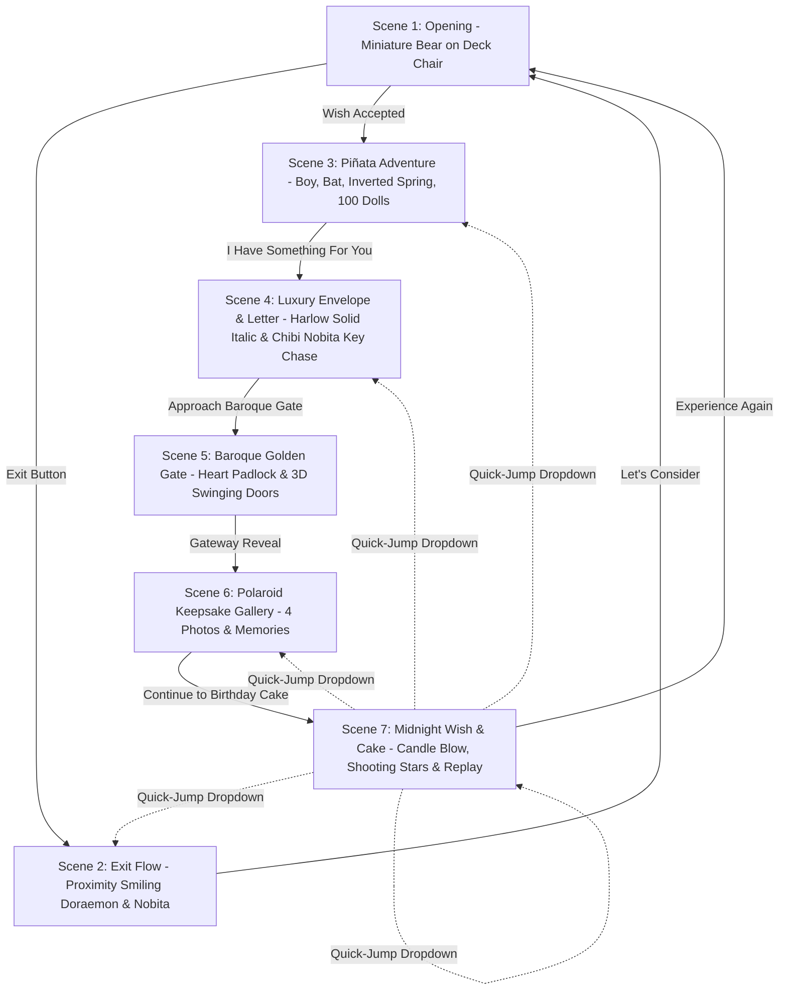

# 🌸 A Special Day For Yuhashvi ♡ | 21st Birthday Interactive Experience

A cinematic, interactive story-game website crafted to celebrate **Yuhashvi's 21st Birthday** on **September 11**. Designed with whimsical storytelling, rich physics-driven interactions, authentic 3D animations, custom typography in **Harlow Solid Italic**, a realigned 4-portion background soundtrack system at a soothing volume level, a majestic Baroque Golden Gate leading to the memory gallery, a midnight wish ceremony, and an interactive memory quick-jump dropdown.

---

## 🌟 The 7-Scene Cinematic Journey



### 1. Scene 1: Opening Scene (`#scene-page1`)
- **Visuals**: A warm, dreamy miniature atmosphere preserving the cute smooth brown bear in a pink polka-dot swimsuit and hibiscus flower resting on beach deck chairs.
- **Atmosphere**: Gentle floating bokeh particles, ambient lighting, and high-contrast glassmorphic card on the left.
- **Narrative**: *"How are you doing in your Favorite and special day of your life ?"*
- **Choices**:
  - `[ 💖 Wish Accepted ]` → Begins the magical journey into the Piñata Adventure.
  - `[ 🚪 Exit ]` → Enters the playful Doraemon & Nobita exit flow.

### 2. Scene 2: Playful Exit Flow (`#scene-exit`)
- **Visuals**: A cosmic dark glassmorphism space with floating stars and deep space nebulae.
- **Interactive Proximity**: Doraemon and Nobita sit looking sad (*"Are you truly ready to leave this behind?"*). As your mouse cursor or touch approaches the `[ 🥺 Let's consider ]` button, their facial expressions smoothly transition into bright, cheerful smiles with sparkling eyes!
- **Ongoing Page Complete Teardown**: Whenever navigating to the exit page from any ongoing scene (Scene 1, Piñata, Letter, Gate, Gallery), all ongoing background timers, loops, physics RAFs, and character animations are completely stopped.
- **Single Reconsideration Option**:
  - `[ 🥺 Let's consider ]`: Doraemon & Nobita smile happily and return smoothly to Scene 1 to continue the magical story.

### 3. Scene 3: Piñata Adventure (`#scene-pinata`)
- **Cinematic Prologue**:
  - The chibi girl character walks gracefully onto the fairytale pastel meadow.
  - The boy character peeks from behind a tree on the left and throws an authentic 3D wooden baseball bat across the screen with a comic **"BAM!"** sound.
  - The girl catches the bat and attempts 3 jumping swings, missing because the piñata is hanging too high.
  - Her speech bubble asks: *"Help me! 🥺"*.
  - A bright shooting star streaks across the sky, cascading starlight down the rope and unlocking the interactive height control handle.
- **Core Mechanics**:
  - **Inverted Spring Physics**: Moving the mouse **UP** lowers the piñata so she can reach it; moving **DOWN** raises it.
  - **Floating Cursor Tooltip**: When the piñata is pulled down into striking range, a glowing pill prompt `[ 🎯 Tap to hit piñata ]` dynamically tracks the mouse pointer. It only appears when she can reach and hit, hiding automatically if raised out of reach or while she is mid-swing!
  - **4-Hit Breaking Sequence**: `THUMP!` → `BAM!` → `WHACK!` → `CRACK!` (shatters in an explosion of confetti).
  - **100 Doraemon Cascade**: A shower of 100 miniature Doraemon dolls tumbles down with full gravity, bouncing and burying the stage. After a comedic beat, the girl peeks out from the doll mound with a joyful smile!
  - **Royal Scroll Banner**: An unrolling ancient parchment reveals *"Happy Birthday Yuhashvi ♡"* and the button `[ 💌 I have something for you ]`.

### 4. Scene 4: Luxury Envelope, Letter & Chibi Nobita Chase (`#scene-page2`)
- **Visuals**: Soft pastel cream and rose gradient background with floating heart particles.
- **Stationery Design**: A luxury rectangular ivory envelope adorned with burgundy ribbon, ornate corner florals, gold accents, and a central wax seal.
- **Interactive Wax Seal**: Clicking either the wax seal or `[ 💌 Open Your Envelope ]` flips the flap open and slides out the textured parchment paper.
- **Custom Typography**: The letter is rendered in **Harlow Solid Italic** (`'Harlow Solid Italic', 'Harlow Solid', 'Alex Brush', cursive, sans-serif`).
- **Word-Processor Vertical Scrollbar**: Features a clean custom vertical scrollbar (`overflow-y: auto !important`) that allows smooth scrolling through the heartfelt Tamil message like a Microsoft Word document, with automatic scroll-tracking during the typewriter effect.
- **Exact Narrative Sequence**:
  1. Recipient taps the golden wax seal or `[ 💌 Open Your Envelope ]`.
  2. Envelope flap flips open and textured parchment rises out.
  3. The letter text types out smoothly in **Harlow Solid Italic**. Nobita and the Approach Gate button are strictly hidden during this time.
  4. **Only after all words are revealed**, Chibi Nobita appears in the lower safe lane and runs back and forth holding the **Golden Heart Key** (*"Catch me! 🏃‍♂️"*).
  5. Catching Nobita displays the celebratory modal and officially unlocks the `[ 🗝️ Approach the Baroque Gate ]` button. User can either approach immediately or stay to admire the letter before advancing.

### 5. Scene 5: Baroque Golden Gate (`#scene-gate`)
- **Photorealistic 3D Architecture**:
  - Rendered with 100% transparent alpha background.
  - Sliced into Left Marble Pillar with Glass Lantern, Right Marble Pillar with Glass Lantern, and Left and Right Full-Height Ornate Golden Doors.
  - Center features an intricately carved **Heart Padlock** with keyhole.
- **Unlocking Mechanism**:
  - Clicking the padlock assembly makes the Golden Heart Key float into the keyhole.
  - The key inserts and turns **90°** with a crisp metallic chime.
  - The padlock releases with a sparkle burst and drops away.
  - Both doors physically swing open in 3D perspective (`perspective(1200px) rotateY(-82deg)` and `rotateY(82deg)`).
  - Through the open gateway, the celestial portal transitions directly into **The Polaroid Keepsake Gallery**!

### 6. Scene 6: Polaroid Keepsake Gallery (`#scene-gallery`)
- **Polaroid Display**: Four vintage polaroid cards with organic rotations (`-4°`, `+3°`, `-2°`, `+4°`), soft drop shadows, and thoughtful captions celebrating Yuhashvi.
- **Hover & Focus**: Hovering any card smoothly straightens it, elevates it with a golden glow, and zooms the photo.
- **Progression**: Button `[ 🎂 Continue to the Birthday Cake ]` advances directly to the final night celebration.

### 7. Scene 7: Midnight Wish, Candle Extinguish & Memory Revisit (`#scene-final`)
- **Photographic Dual-Layer Engine**:
  - **Base Layer**: High-resolution night garden scene with lit candles on a birthday cake, glowing lanterns, and Yuhashvi in traditional attire.
  - **Dynamic Candle Flames**: Realistic CSS canvas flicker flames superimposed on the cake candles.
- **Candle Blow Sequence**:
  - Clicking `[ ✨ Blow the Candles & Make a Wish ]` emits a focused breath particle stream toward the cake.
  - Candle flames extinguish, producing realistic rising curls of smoke.
  - The lit layer crossfades seamlessly into the midnight starfield layer (`final_night_stars.jpg`) featuring shooting stars and purple nebula skies.
  - A frosted card presents the birthday message:
    > *"The world needs a doctor with a heart like yours. Go get it."*
    > 
    > **Keep smiling. ♡**
  - Clicking `[ ↻ Experience Again ]` cleanly resets all 7 scenes, animations, audio tracks, and particles, returning to Scene 1 without refreshing the browser.
- **Memory Quick-Jump Dropdown**:
  - Located right below the Experience Again button.
  - Allows instant access to any specific memory chapter:
    1. 🎮 The Fairytale Piñata Quest
    2. 🥺 Doraemon & Nobita's Heartfelt Realm
    3. 💌 The Scalloped Envelope & Love Letter
    4. 🌸 The Polaroid Keepsake Gallery
    5. 🎂 The Midnight Wish & Candle Ceremony
- **Two-Option Revisit Navigation HUD**:
  - When revisiting a specific step, a floating HUD appears at the top giving two choices:
    - `[ ⏩ Return to Final Page ]`: Instantly returns to the midnight cake scene with the celebration card and stars intact!
    - `[ ▶️ Continue Natural Flow ]`: Hides the HUD and allows the recipient to continue playing naturally from that point forward!

---

## 🎵 4-Portion Audio Architecture

The site divides its soundtrack into four continuous portions, ensuring no abrupt restarts and playing at an optimal, crystal-clear sound level (**volume 0.39 / 39%**):

| Audio Portion | Scenes Active | Audio Track File | Continuity Behavior |
| :--- | :--- | :--- | :--- |
| **Portion 1: Opening & Exit** | Scene 1 (Page 1) & Scene 2 (Exit) | `assets/audio/opening.mp3` | Plays from "Let's Begin" through Page 1 and Exit flow with zero restart. |
| **Portion 2: Piñata Game** | Scene 3 (Piñata Adventure) | `assets/audio/pinata.mp3` | Dedicated energetic soundtrack playing throughout the entire piñata game and 100 Doraemon doll cascade. |
| **Portion 3: The Letter** | Scene 4 (Envelope & Letter) | `assets/audio/letter_gallery.mp3` | Soothing romantic piano & acoustic melody for unsealing and reading the letter. |
| **Portion 4: Gate, Gallery & Cake** | Scene 5 (Gate), Scene 6 (Gallery), Scene 7 (Cake) | `assets/audio/final.mp3` | **One shared soundtrack** that starts at the Baroque Gate unlock and plays continuously across Gate, Gallery, and the Cake scene without interruption! |

### Built-in Procedural Audio Synthesizer Fallback
If custom MP3 files are omitted or blocked by browser policies, the built-in procedural Web Audio API synthesizer automatically produces dreamy kalimba notes, metallic clicks, confetti pops, and ambient pads so that **no audio error ever occurs**.

---

## ⚡ Synchronized Progressive Preloader

A byte-accurate download manager tracks all 30 essential assets (totaling **20.98 MB**):
- **Live Byte Tracking**: Shows real-time downloaded megabytes (`XX.X MB / 20.98 MB`) and percentage.
- **Audio Priority**: Prioritizes downloading `opening.mp3` first so music is ready the exact instant the user clicks "Let's Begin".
- **Earphones & Desktop Hints**: Highlighting recommendations for best audio and visual immersion.

---

## 📂 Project Directory Structure

```text
Yuhashvi_Key-B-day/
├── index.html                  # Main single-page application entry point
├── style.css                   # Complete stylesheet (responsive, 3D gates, scrollbars, revisit HUD)
├── config.js                   # Master configuration for all texts, photos & audio
├── README.md                   # Project overview & documentation
├── CUSTOMIZATION_GUIDE.md      # Comprehensive asset replacement manual
├── assets/
│   ├── audio/                  # Audio tracks (opening, pinata, letter_gallery, final)
│   ├── characters/             # Girl, boy, runner sprites
│   └── images/                 # Gate slices, polaroids, envelope, final night scenes
└── js/
    ├── app.js                  # Finite State Machine & revisit HUD orchestrator
    ├── audio-system.js         # 4-portion audio engine & Web Audio synthesizer
    ├── preloader.js            # Progressive asset preloader with byte counter
    ├── particle-system.js      # Fullscreen canvas particles (confetti, bokeh, stars)
    ├── doraemon-physics.js     # 2D physics engine for 100 falling Doraemon dolls
    ├── characters/
    │   ├── girl-character.js   # Articulated puppet controller for the girl
    │   └── boy-character.js    # Peeking & bat throwing controller
    └── scenes/
        ├── page1-scene.js      # Scene 1: Opening
        ├── exit-scene.js       # Scene 2: Exit flow with proximity smiles
        ├── pinata-scene.js     # Scene 3: Piñata mini-game
        ├── page2-envelope.js   # Scene 4: Luxury envelope, letter & Nobita key chase
        ├── gate-scene.js       # Scene 5: Baroque Golden Gate & padlock
        ├── photo-gallery.js    # Scene 6: Scrapbook & polaroids
        └── final-scene.js      # Scene 7: Midnight wish, candle blow & chapter jump
```

---

## 🚀 How to Run Locally

### Option 1: Direct Browser Launch
Double-click `index.html` to open it in Google Chrome, Microsoft Edge, Mozilla Firefox, or Brave.

### Option 2: Local Static Server (Recommended)
Using Node.js:
```bash
npx serve .
```
Or with Python:
```bash
python -m http.server 8080
```
Then navigate to `http://localhost:8080/` in your browser.

---

## 🛠️ Modifying & Customizing Content

To customize texts, photos, audio, or colors without touching any game logic, refer to the full **[CUSTOMIZATION_GUIDE.md](file:///k:/Yuhashvi_Key-B-day/CUSTOMIZATION_GUIDE.md)**.
